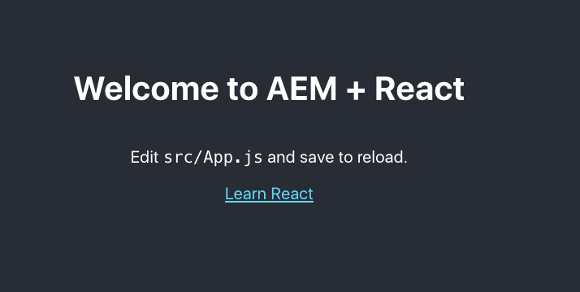
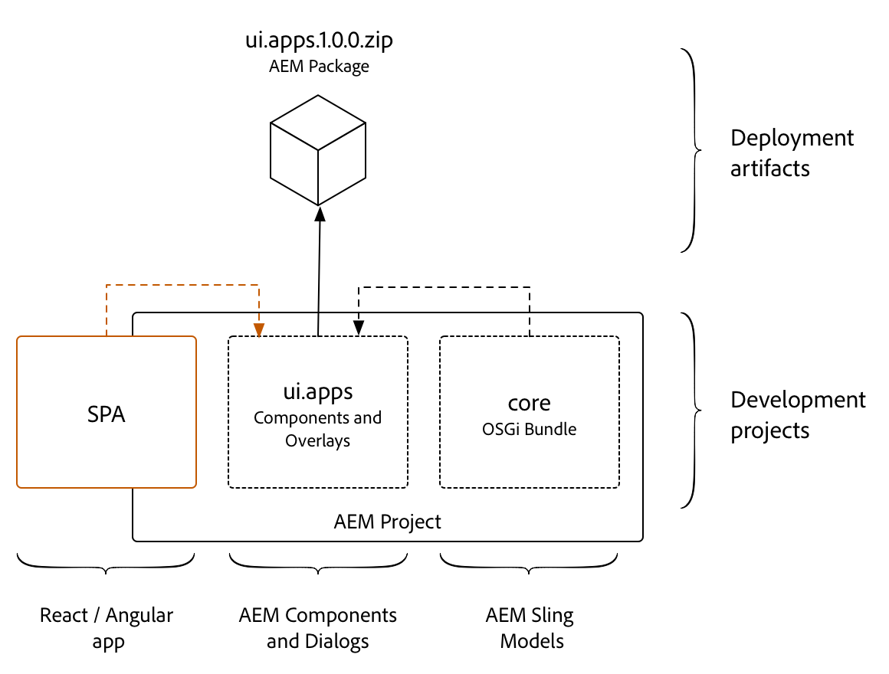

# Chapter 0 - Project Setup

This chapter details the creation of an AEM project with a dedicated module for Single Page Application or SPA development. SPA development has one foot in AEM development, and the other out. The goal for this chapter is to allow SPA development to occur independently, and (mostly) agnostic to AEM.

> **Persona:** AEM Developer

## Local Development Environment

A local development environment is necessary to complete this tutorial. Screenshots and video are captured from a Mac OS environment but the commands and code used should be independent of the local operating system, unless otherwise noted.

The following should be installed:

* [Java 1.8](http://www.oracle.com/technetwork/java/javase/downloads/index.html)
* [Apache Maven](https://maven.apache.org/) (3.3.9 or newer)
* [Node.js v10+](https://nodejs.org/en/)
* [npm 6+](https://www.npmjs.com/)
* AEM 6.4 + SP2

Start by double checking that the above tools have been installed and available via the path. Open up a new terminal and run the following commands:

```
$ java -version
java version "1.8.0_111"
Java(TM) SE Runtime Environment (build 1.8.0_111-b14)
Java HotSpot(TM) 64-Bit Server VM (build 25.111-b14, mixed mode)
 
$ mvn -version
Apache Maven 3.3.9
Maven home: /Library/apache-maven-3.3.9
Java version: 1.8.0_111, vendor: Oracle Corporation
Java home: /Library/Java/JavaVirtualMachines/jdk1.8.0_111.jdk/Contents/Home/jre
 
$ node --version
v10.8.0
 
$ npm --version
6.2.0
```
## Download Starter Project

To accelerate the tutorial we will start from a predefined project. Download the following ZIP file and unzip locally:

Download: [Starter Project](../aem-guides-wknd-events-START.zip)

You can also fork the [Git Repository](#) and start the tutorial from there:
    
```
$ git clone git@git.corp.adobe.com:aem-technical-marketing/aem-guides-wknd-events.git
$ cd aem-guides-wknd-events
$ git checkout start
```
    
## Inspect the AEM Project

There are a couple options for creating a Maven Multimodule project for AEM. This tutorial leverages the [Maven AEM Project Archetype 14](https://github.com/Adobe-Marketing-Cloud/aem-project-archetype). Another perfectly valid approach is to use [ACS AEM Lazybones template](https://github.com/Adobe-Consulting-Services/lazybones-aem-templates). 

The following properties were used when generating the AEM project from [Archetype 14](https://github.com/Adobe-Marketing-Cloud/aem-project-archetype/releases/tag/aem-project-archetype-14):

| Property       | Value  |
|----------      |--------|
| groupId        | com.adobe.aem.guides |   
| artifactId     | aem-guides-wknd-events |
| version        | 0.0.1-SNAPSHOT  |
| package        | com.adobe.aem.guides.wkndevents |
| appsFolderName | wknd-events |
| artifactName   | WKND Events |
| componentGroupName | WKND Events - Content |
| confFolderName | wknd-events |
| contentFolderName | wknd-events |
| cssId          | wknd-events |
| packageGroup   | aem-guides/wknd-events |
| siteName       | WKND Events |

1. **Inspecting the Project**

    There are five areas to the project:

    * **Parent POM** - deploys maven modules and manages dependency versions
    * **core** - Java bundle containing all core functionality like OSGi services, listeners or schedulers, as well as component-related Java code such as servlets or request filters.
    * **ui.apps** - contains the /apps parts of the project, ie JS&CSS clientlibs, components, runmode specific configs as well as Hobbes-tests
    * **ui.content** - contains structural content and configurations (/content, /conf)
    * **react-app** - a webpack project for the React application to be deployed to AEM as a client library.

    More details about the inner workings of the project can be found in [Getting Started with AEM Sites Part 1 - Project Setup](https://helpx.adobe.com/experience-manager/kt/sites/using/getting-started-wknd-tutorial-develop/part1.html#project-structure). Later in this chapter a new maven module will be added that will contain the SPA source code.

2. **Build and deploy the project to a local AEM instance**

    From the command line, within the `aem-wknd-events` directory run the following:

    ```
    $ mvn -PautoInstallPackage clean install
    ```

    This should deploy the project to AEM running on http://localhost:4502. 

3. **View Package Manager to verify the deployment**

    Navigating to http://localhost:4502/crx/packmgr/index.jsp you should see that 5 packages were installed. The **ui.apps** and **ui.content** package for the WKND events project and 3 packages for AEM Core Components.
    
    

    > If you recieve an error during the build double check that you have configured your maven settings.xml file to include Adobe's nexus repository based on this [article](https://helpx.adobe.com/experience-manager/kb/SetUpTheAdobeMavenRepository.html).

## Inspect the React App

A starter React application has been created using the [create-react-app](https://github.com/facebook/create-react-app#creating-an-app) module from Facebook.

1. **Run the app locally**

    Navigate to the `react-app` directory and run the following commands:

    ```
    $ cd <src-dir>/aem-guides-wknd-events/react-app
    $ npm install
    $ npm start
    ```

2. **View the app**

    This should launch the React app on a local dev server running at http://localhost:3000/.

    
    
3. **Build a production distribution of the app:**

    Press `ctrl+c` to stop the server.

    ```
    ^C
    $ npm run build
    ```

    Notice that several files are created beneath the `react-app/build` folder.

    ```
    /aem-guides-wknd-events
        /react-app
            /build
                /static
                    /css
                        main.<hash>.css
                        main.<hash>.css.map
                    /js
                        main.<hash>.js
                        main.<hash>.js.map
                    /media
                        logo.<hash>.svg
    ```

    In the next section we will move these files into an AEM client library and deploy as part of the `ui.apps` module.

## Integration Approach

The SPA development will occur for the most part in the Webpack project. The compiled SPA, following a production build, is then copied into the `ui.apps` module as an AEM [client-side library](https://helpx.adobe.com/experience-manager/6-4/sites/developing/using/clientlibs.html), or client library, or clientlib and deployed to AEM as part of an AEM package. The concept is similar to the integration of the `core` Java bundle, where the Java bundle is compiled into a jar file that is embedded into the `ui.apps` module and deployed to AEM as an AEM package.



To achieve this integration two tools will be used:

1. [aem-clientlib-generator](https://www.npmjs.com/package/aem-clientlib-generator) - used to transform compiled CSS and JS files into an AEM client library
2. [frontend-maven-plugin](https://github.com/eirslett/frontend-maven-plugin) - used to trigger NPM commands via a Maven build. This plugin will download/install Node and NPM locally for the project, ensuring consistency and making the project easy to integrate with a Continuous Integration/Continuous Deployment environment. 


The process illustrated above is as follows

1. The **frontend-maven-plugin** is triggered during a Maven build which will ensure that Node/NPM is installed and then call an **npm** command to build a production distribution of the app.
2. The **aem-clientlibs-generator** npm module is then run to copy the distribution files into the `ui.apps` module as an AEM [clientlib](https://helpx.adobe.com/experience-manager/6-4/sites/developing/using/clientlibs.html).
3. Finally the `ui.apps` module is compiled and deployed to AEM as a package.

## Configure aem-clientlibs-generator

1. Install the **[aem-clientlibs-generator](https://www.npmjs.com/package/aem-clientlib-generator)** node plugin as part of the `react-app` project.

    ```
    $ cd <src>/aem-guides-wknd-events/react-app
    $ npm install aem-clientlib-generator --save-dev
    ```
2. Notice that `package.json` has been updated with the dev dependencies for **aem-clientlib-generator**.

    ```
    //package.json
    {
        "name": "react-app",
        "version": "0.1.0",
        "private": true,
        "dependencies": {
            "react": "^16.5.2",
            "react-dom": "^16.5.2",
            "react-scripts": "1.1.5"
        },
        "scripts": {
            "start": "react-scripts start",
            "build": "react-scripts build",
            "test": "react-scripts test --env=jsdom",
            "eject": "react-scripts eject"
        },
        "devDependencies": {
            "aem-clientlib-generator": "^1.4.1"
        }
    }
    ```

3. Create a new file beneath the `/react-app` folder named `clientlib.config.js`. Populate the file with the following:

    ```
    module.exports = {
        // default working directory (can be changed per 'cwd' in every asset option)
        context: __dirname,

        // path to the clientlib root folder (output)
        clientLibRoot: "./../ui.apps/src/main/content/jcr_root/apps/wknd-events/clientlibs",

        libs: {
            name: "react-app",
            allowProxy: true,
            categories: ["wknd-events.react"],
            serializationFormat: "xml",
            jsProcessor: ["min:gcc"],
            assets: {
                js: [
                    "build/static/**/*.js"
                ],
                css: [
                    "build/static/**/*.css"
                ]
            }
        }
    };
    ```
    This file directs the **aem-clientlib-generator** to create a client library in the `ui.apps` module beneath  `/apps/wknd-events/clientlibs`. The client library will have a category of `wknd-events.react` and will include any files with an extension of `.js` and `.css` beneath the `react-app/build/static` folder.

4. Add the `clientlib` directive as part of the `npm run build` script by updating `react-app/package.json` file with the following line:

    **Old line - package.json**

    ```
     "scripts": {
        "build": "react-scripts build",
    }
    ```

    **New line - package.json**

    ```
     "scripts": {
        "build": "react-scripts build && clientlib --verbose",
    }
    ```
5. Test out the changes by running the following command:

    ```
    $ cd <src>/aem-guides-wknd-events/react-app
    $ npm run build

    > react-scripts build && clientlib --verbose

    Creating an optimized production build...
    Compiled successfully.

    File sizes after gzip:

    37.34 KB  build/static/js/main.d1cb61c2.js
    299 B     build/static/css/main.c17080f1.css

    The project was built assuming it is hosted at the server root.
    You can control this with the homepage field in your package.json.
    For example, add this to build it for GitHub Pages:

    "homepage" : "http://myname.github.io/myapp",

    The build folder is ready to be deployed.
    You may serve it with a static server:

    npm install -g serve
    serve -s build

    Find out more about deployment here:

    http://bit.ly/2vY88Kr


    start aem-clientlib-generator
    working directory: ../src/aem-guides-wknd-events/react-app


    processing clientlib: react-app
    Write node configuration using serialization format: xml
    write clientlib json file: ../ui.apps/src/main/content/jcr_root/apps/wknd-events/clientlibs/react-app/.content.xml

    write clientlib asset txt file (type: js): ../ui.apps/src/main/content/jcr_root/apps/wknd-events/clientlibs/react-app/js.txt
    copy: build/static/js/main.d1cb61c2.js ../ui.apps/src/main/content/jcr_root/apps/wknd-events/clientlibs/react-app/js/main.d1cb61c2.js

    write clientlib asset txt file (type: css): ../ui.apps/src/main/content/jcr_root/apps/wknd-events/clientlibs/react-app/css.txt
    copy: build/static/css/main.c17080f1.css ../ui.apps/src/main/content/jcr_root/apps/wknd-events/clientlibs/react-app/css/main.c17080f1.css
    ```
6. Beneath `/ui.apps/src/main/content/jcr_root/apps/wknd-events/clientlibs/` should be a new folder named `react-app` and should contain both the `main.<hash>.css` and `main.<hash>.js` files.

7. (Optional) Ignore the `react-app` AEM client library in `ui.apps` from source control.

    The client library `react-app` in `ui.apps` should always be generated by the **aem-clientlib-generator** at build time. It is important ignore this client library from source control. For example, if using Git, a file named `.gitignore` would be created beneath the `ui.apps` folder:

    ```
    # ui.apps/.gitignore
    # Ignore React generated client libraries from source control
    react-app
    ```

## Configure frontend-maven-plugin

Next, configure the `react-app` project to also be a Maven module. This way it can be triggered by the parent reactor POM and the entire AEM project can be built with a single command. As mentioned earlier the **[frontend-maven-plugin](https://github.com/eirslett/frontend-maven-plugin)** will be used to install and trigger an npm build within the `react-app` project.

1. Open up the parent reactor POM,`<src>/aem-guides-wknd-events/pom.xml`, and add the `react-app` as a module to build. The order in which the modules are built matters:

    ```
    ...
    <modules>
        <module>core</module>
        <!-- add React App -->
        <module>react-app</module>
        <module>ui.apps</module>
        <module>ui.content</module>
    </modules>
    ...
    ```
2.  Within the parent reactor POM, `<src>/aem-guides-wknd-events/pom.xml`, and add the following properties for the **frontend-maven-plugin**,**node** and **npm** versions.

    > Important, use the same version of **node** and **npm** that you have installed locally.

    ```
    ...
     <properties>
        <aem.host>localhost</aem.host>
        <aem.port>4502</aem.port>
        <aem.publish.host>localhost</aem.publish.host>
        <aem.publish.port>4503</aem.publish.port>
        <sling.user>admin</sling.user>
        <sling.password>admin</sling.password>
        <vault.user>admin</vault.user>
        <vault.password>admin</vault.password>

        <!-- Update: Used by frontend-maven-plugin -->
        <frontend-maven-plugin.version>1.6</frontend-maven-plugin.version>
        <node.version>v10.8.0</node.version>
        <npm.version>6.2.0</npm.version>
        <!-- end update -->

        <project.build.sourceEncoding>UTF-8</project.build.sourceEncoding>
        <project.reporting.outputEncoding>UTF-8</project.reporting.outputEncoding>
    </properties>
    ...
    ```
    These properties will be used by the **frontend-maven-plugin** to determine the local version of **node** and **npm** to install. As a best practice version properties should be managed at the parent pom level.

2. Create a new file named `pom.xml` beneath `<src>/aem-guides-wknd-events/react-app` folder. Populate the `pom.xml` with the following:

    ```
    <?xml version="1.0" encoding="UTF-8"?>
    <project xmlns="http://maven.apache.org/POM/4.0.0" xmlns:xsi="http://www.w3.org/2001/XMLSchema-instance" xsi:schemaLocation="http://maven.apache.org/POM/4.0.0 http://maven.apache.org/maven-v4_0_0.xsd">
        <modelVersion>4.0.0</modelVersion>

        <!-- ====================================================================== -->
        <!-- P A R E N T  P R O J E C T  D E S C R I P T I O N                      -->
        <!-- ====================================================================== -->
        <parent>
            <groupId>com.adobe.aem.guides</groupId>
            <artifactId>aem-guides-wknd-events</artifactId>
            <version>0.0.1-SNAPSHOT</version>
            <relativePath>../pom.xml</relativePath>
        </parent>

        <!-- ====================================================================== -->
        <!-- P R O J E C T  D E S C R I P T I O N                                   -->
        <!-- ====================================================================== -->
        <artifactId>aem-guides-wknd-events.react</artifactId>
        <packaging>pom</packaging>
        <name>WKND Events - React App</name>
        <description>UI React application code for WKND Events</description>


        <!-- ====================================================================== -->
        <!-- B U I L D   D E F I N I T I O N                                        -->
        <!-- ====================================================================== -->
        <build>
        <plugins>
        <plugin>
            <groupId>com.github.eirslett</groupId>
            <artifactId>frontend-maven-plugin</artifactId>
            <version>${frontend-maven-plugin.version}</version>

            <executions>

            <execution>
                <id>install node and npm</id>
                <goals>
                <goal>install-node-and-npm</goal>
                </goals>
                <configuration>
                <nodeVersion>${node.version}</nodeVersion>
                <npmVersion>${npm.version}</npmVersion>
            </configuration>
            </execution>

            <execution>
                <id>npm install</id>
                <goals>
                <goal>npm</goal>
                </goals>
                <!-- Optional configuration which provides for running any npm command -->
                <configuration>
                <arguments>install</arguments>
                </configuration>
            </execution>

            <execution>
                <id>npm run build</id>
                <goals>
                <goal>npm</goal>
                </goals>
                <configuration>
                <arguments>run build</arguments>
                </configuration>
            </execution>

            </executions>
        </plugin>
        </plugins>
    </build>
    </project>
    ```

3. Within the `react-app` folder run the following Maven command to trigger a build:

    ```
    $ cd <src>/aem-guides-wknd-events/react-app
    $ mvn clean install
    ```

    You should see that the **frontend-maven-plugin** downloads and installs a local version of node and npm. The command `npm run build` is then executed which will build the React app and then copy the compiled JS and CSS files into the `ui.apps` project.

4. Check the timestamps of `/ui.apps/src/main/content/jcr_root/apps/wknd-events/clientlibs/react-app/css/main.<hash>.css` and `/ui.apps/src/main/content/jcr_root/apps/wknd-events/clientlibs/react-app/js/main.<hash>.js` to confirm that these files were just built.

5. Navigate to the Parent Reactor POM and run the following command to build the entire project and deploy it to AEM:

     ```
    $ cd <src>/aem-guides-wknd-events
    $ mvn -PautoInstallPackage clean install

    ...
    [INFO] Reactor Summary:
    [INFO]
    [INFO] aem-guides-wknd-events ............................. SUCCESS [  0.343 s]
    [INFO] WKND Events - Core ................................. SUCCESS [  4.794 s]
    [INFO] WKND Events - React App ............................ SUCCESS [ 17.874 s]
    [INFO] WKND Events - UI apps .............................. SUCCESS [  3.920 s]
    [INFO] WKND Events - UI content ........................... SUCCESS [  0.561 s]
    [INFO] WKND Events - Integration Tests Bundles ............ SUCCESS [  0.745 s]
    [INFO] WKND Events - Integration Tests Launcher ........... SUCCESS [  2.001 s]
    [INFO] ------------------------------------------------------------------------
    [INFO] BUILD SUCCESS
    [INFO] ------------------------------------------------------------------------
    ...
    ```

6. Navigate to [CRXDE-Lite](http://localhost:4502/crx/de/index.jsp#/apps/wknd-events/clientlibs/react-app) to verify that the React App and the rest of the AEM project has been deployed beneath `/apps/wknd-events/clientlibs/react-app`.

    

## Next: [Chapter 1](../chapter-1/chapter-1.md)

In the next chapter we will configure an AEM page and template to include a client library containing the React app.

