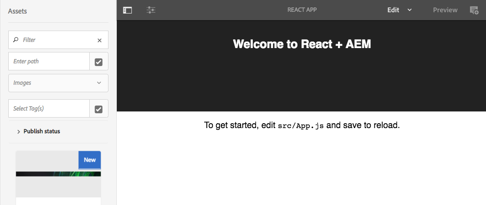

# Chapter 1 - App Page Setup

In this chapter we will setup the AEM project to include the SPA on an AEM page by updating a base page component to include the compiled SPA as a client library. We will also inspect the Sling Model Exporter used to expose the content of an AEM page as JSON.  This JSON model will ultimately drive the SPA.

> **Persona:** AEM Backend Developer

## Understanding the HierarchyPage Sling Model

The AEM SPA JS SDK is designed to parse a JSON schema into a JavaScript Model.  A Sling Model, `HierarchyPage.java` has been included in the starter project that will expose content within AEM as JSON that matches the expected schema. A key feature of the exported JSON by the `HierarchyPageImpl` is the ability to expose the content of multiple AEM pages in a single request. This allows the SPA to be initialized with most of the content of the app and can remove the need for subsequent requests as a user navigates the app.

In the editor of your choice open the `<src>/aem-guides-wknd-events/core` module. 

1. **Open `core/src/main/java/com/adobe/aem/guides/wkndevents/core/models/HierarchyPage.java`**

    ```
    package com.adobe.aem.guides.wkndevents.core.models;

    import com.adobe.cq.export.json.ContainerExporter;
    import com.adobe.cq.export.json.hierarchy.HierarchyNodeExporter;
    import com.fasterxml.jackson.annotation.JsonIgnore;
    import com.fasterxml.jackson.annotation.JsonProperty;

    public interface HierarchyPage extends HierarchyNodeExporter, ContainerExporter {

        ...
    }
    ```

    The interface `HierarchyPage` extends two interfaces:

    * **ContainerExporter** - Defines the JSON of a container component like a page, responsive grid, or parsys
    * **HierarchyNodeExporter** - Defines the JSON of a hierarchical node, like a root page and it's child pages

2. **Open `core/src/main/java/com/adobe/aem/guides/wkndevents/core/models/impl/HierarchyPageImpl.java`**

    This is the implementation of the `HierarchyPage` interface. 

      > Note* currently the HieararchyPageImpl is copied into the project. In the near future a default HieararchyPageImpl will be made available via Core Components. Developers will continue to have the option to extend but will no longer be responsible for maintaining the implementation. Make sure to check back for updates.


    ```
    @Model(adaptables = SlingHttpServletRequest.class, adapters = {HierarchyPage.class, ContainerExporter.class}, resourceType = HierarchyPageImpl.RESOURCE_TYPE)
    @Exporter(name = ExporterConstants.SLING_MODEL_EXPORTER_NAME, extensions = ExporterConstants.SLING_MODEL_EXTENSION)
    public class HierarchyPageImpl implements HierarchyPage {

    /**
     * Resource type of associated with the current implementation
     */
    protected static final String RESOURCE_TYPE = "wknd-events/components/structure/page";
    ```

    The `HierarchyPageImpl` is registered as Sling Model Exporter for the `wknd-events/components/structure/page` resource type. If implementing a custom project you would update the `RESOURCE_TYPE` to point to your project's base page component.

    The methods `getRoodModel()` and `getRootPage()` are used to find and return what is considered to be the "root" of the application. There are three properties stored on an App template's policy used to drive the collection of content:
    
    1. `PR_IS_ROOT = "isRoot"` -  Helps identify the `rootPage` of the application. The `rootPage` is used as the starter point to collect all the child pages of the app.
    2. `STRUCTURE_DEPTH_PN = "structureDepth"` - identifies how deep in the hierarchy to collect child pages.
    3. `STRUCTURE_PATTERNS_PN = "structurePatterns"` - a regular expression that can be used to ignore or exclude certain pages from automatically being collected. 

3. **Open up [CRXDE-Lite](http://localhost:4502/crx/de/index.jsp#/conf/wknd-events/settings/wcm/policies/wknd-events/components/structure/app/default)**

    Navigate to `/conf/wknd-events/settings/wcm/policies/wknd-events/components/structure/app/default`. This is the policy for the `wknd-events-app-template` template. Notice the properties for `isRoot`, `structureDepth`, `structurePatterns`.

    

4. Open the React Root Page at http://localhost:4502/content/wknd-events/react.html

    The page may render blank for now. This page is built using the `wknd-events-app-template`.

5. Change the extension to `model.json`: http://localhost:4502/content/wknd-events/react.model.json

    Notice that content of the current page is exposed and the content of child page: /content/wknd-events/react/home.

    ```
    // /content/wknd-events/react.model.json 

    {
    ":type": "wknd-events/components/structure/app",
    ":items": {},
    ":itemsOrder": [],
    ":children": {
    "/content/wknd-events/react/home": {
        ":type": "wknd-events/components/structure/page",
        ":items": { ... },
        ":itemsOrder": [
        "root"
        ],
        ":path": "/content/wknd-events/react/home",
        ":hierarchyType": "page",
        "title": "Home"
        }
    },
    ":path": "/content/wknd-events/react",
    ":hierarchyType": "page",
    "title": "React App"
    }
    ```

## Integrate the React app on the Page

Next we will integrate the React app on to the page via the client library.

Open up the `ui.apps` project to edit.

1. **Beneath `/apps/wknd-events/components/structure/page` open the file `customheaderlibs.html`.**

    This HTL template will get loaded in the HTML `<head>` section.
    
    Replace the contents of the file with the following:

    ```
    <!--/*
    Custom Headerlibs for React Site
    */-->
    <meta name="viewport" content="width=device-width, initial-scale=1, shrink-to-fit=no">
    <meta property="cq:datatype" data-sly-test="${wcmmode.edit || wcmmode.preview}" content="JSON"/>
    <meta property="cq:wcmmode" data-sly-test="${wcmmode.edit}" content="edit"/>
    <meta property="cq:wcmmode" data-sly-test="${wcmmode.preview}" content="preview"/>
    <meta property="cq:pagemodel_root_url" 
        data-sly-use.page="com.adobe.aem.guides.wkndevents.core.models.HierarchyPage" 
        content="${page.rootUrl}"/>
    <sly data-sly-use.clientlib="/libs/granite/sightly/templates/clientlib.html">
    <sly data-sly-call="${clientlib.css @ categories='wknd-events.react'}"/>
    ```

    This will load the CSS for the `wknd-events.react` client library at the top of the page. This will also set a meta property for `cq:pagemodel_root_url`. This will be used by the AEM SPA Editor SDK to identify the root page JSON to load.

2. **Beneath `/apps/wknd-events/components/structure/page` open the file `customfooterlibs.html`.**

    This HTL template will get loaded at the bottom of the page right before the closing `</body>` tag.

    Replace the contents of the file with the following:

    ```
    <!--/*
    Custom footer React libs
    */-->
    <sly data-sly-use.clientLib="${'/libs/granite/sightly/templates/clientlib.html'}"></sly>
    <sly data-sly-test="${wcmmode.edit || wcmmode.preview}"
        data-sly-call="${clientLib.js @ categories='cq.authoring.pagemodel.messaging'}"></sly>
    <sly data-sly-call="${clientLib.js @ categories='wknd-events.react'}"></sly>
    ```

    This will load the JS for the `wknd-events.react` client library at the bottom of the page. The code above also incluces the `cq.authoring.pagemodel.messaging` when the page is being edited in the AEM environment. This client library allows for the SPA editing capabilities using the AEM Sites Editor.

3. **Create a new file named `body.html` beneath `/apps/wknd-events/components/structure/page`**

    Populate `body.html` with the following:

    ```
    <!--/*
    - body.html
    - includes div that will be targeted by SPA
    */-->
    <div id="root"></div>
    ```

    This will insert the DOM element that the React application is targeting. You can see in the code `/aem-guides-wknd-events/react-app/src/index.js`:

    ```
    ReactDOM.render(<App />, document.getElementById('root'));
    ```

4. **Deploy the changes to AEM**

    Deploy the changes by running the following maven command:

    ```
    $ cd aem-guides-wknd-events
    $ mvn -PautoInstallPackage clean install
    ```

5. **Navigate to http://localhost:4502/editor.html/content/wknd-events/react.html**

    You should now see the React application being rendered on the AEM page.

    


## Next: [Chapter 2](../chapter-2/chapter-2.md)

In the next chapter we will configure an AEM page and template to include a client library containing the React app.
