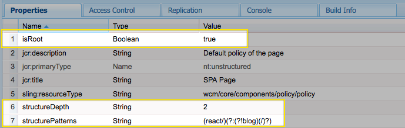

# Chapter 1 - First Editable Components

In this chapter we will install the AEM SPA Editor JS SDK as part of the `react-app` module. We will then implement two React components that will map to AEM Text and Image components. This will allow authors in AEM to edit the content of these components. We will also inspect the Sling Model Exporter used to expose the content of an AEM page as JSON.  This JSON model is ultimately what drives the content exposed in the SPA.

> **Persona:** Front End Developer

## Install AEM SPA Editor JS SDK

Next, we will install the AEM SPA Editor JS SDK as part of the `react-app` project using `npm`.

1. **Open a new terminal window and navigate into the `react-app` directory**

    ```bash
    $ cd <src>/aem-guides-wknd-events/react-app
    ```

2. **Install [@adobe/cq-spa-component-mapping](https://www.npmjs.com/package/@adobe/cq-spa-component-mapping)**

    ```bash
    $ npm install @adobe/cq-spa-component-mapping
    ```

    The [@adobe/cq-spa-component-mapping](https://www.npmjs.com/package/@adobe/cq-spa-component-mapping) provides helpers to map AEM Components to SPA components. This module is not tied to a specific SPA framework.

3. **Install [@adobe/cq-spa-page-model-manager](https://www.npmjs.com/package/@adobe/cq-spa-page-model-manager)**

    ```bash
    $ npm install @adobe/cq-spa-page-model-manager
    ```

    The [@adobe/cq-spa-page-model-manager](https://www.npmjs.com/package/@adobe/cq-spa-page-model-manager) provides the API to manage the model representation of the AEM Pages that are used to compose a SPA. This module is not tied to a specific SPA framework.

4. **Install [@adobe/cq-react-editable-components](https://www.npmjs.com/package/@adobe/cq-react-editable-components)**

    ```bash
    $ npm install @adobe/cq-react-editable-components
    ```

    The [@adobe/cq-react-editable-components](https://www.npmjs.com/package/@adobe/cq-react-editable-components) provides generic React helpers and components to support AEM authoring. This module also wraps the `cq-spa-page-model-manager` and `cq-spa-component-mapping` to make these available to the React framework.

5. **Install peer dependencies**

    Several peer dependencies must be manually installed to the project:

    ```bash
    $ npm install react-fast-compare
    $ npm install ajv --save-dev
    $ npm install clone --save-dev
    ```

6. `react-app/package.json` should now look something like this:

    *Note, versions of dependencies may be slightly different depending on when you are starting this tutorial*

    ```json
    //package.json

    {
    "name": "react-app",
    "version": "0.1.0",
    "private": true,
    "dependencies": {
        "@adobe/cq-react-editable-components": "^1.0.3",
        "@adobe/cq-spa-component-mapping": "^1.0.3",
        "@adobe/cq-spa-page-model-manager": "^1.0.1",
        "react": "^16.5.2",
        "react-dom": "^16.5.2",
        "react-fast-compare": "^2.0.2",
        "react-scripts": "2.0.4"
    },
    "scripts": {
        "start": "react-scripts start",
        "build": "react-scripts build && clientlib --verbose",
        "test": "react-scripts test",
        "eject": "react-scripts eject"
    },
    "eslintConfig": {
        "extends": "react-app"
    },
    "browserslist": [
        ">0.2%",
        "not dead",
        "not ie <= 11",
        "not op_mini all"
    ],
    "devDependencies": {
        "aem-clientlib-generator": "^1.4.1",
        "ajv": "^6.5.4",
        "clone": "^2.1.2"
    }
    }
    ```

## Integrate AEM SPA Editor JS SDK

Next we will integrate the React application with the AEM SPA editor JS SDK. Once this is complete the React app will be driven by a JSON model that originates in AEM. 

Using the editor of your choice open `react-app` under `aem-guides-wknd-events/react-app`.

1. Update the file `index.js` beneath `react-app/src` with the following:

    ```javascript
    // src/index.js

    import React from 'react';
    import ReactDOM from 'react-dom';
    import { ModelManager, Constants } from '@adobe/cq-spa-page-model-manager';
    import App from './App';
    import "./components/MappedComponents";

    function render(model) {
        ReactDOM.render((
            <App cqChildren={ model[Constants.CHILDREN_PROP] } cqItems={ model[Constants.ITEMS_PROP] } cqItemsOrder={ model[Constants.ITEMS_ORDER_PROP] }
                cqPath={ ModelManager.rootPath } locationPathname={ window.location.pathname }/>), document.getElementById('root'));
    }

    ModelManager.initialize({ path: process.env.REACT_APP_PAGE_MODEL_PATH }).then(render);
    ```

    This update will intialize the `App` with the JSON Model from AEM.

2. Update the file `App.js` beneath `react-app/src` with the following:

    ```javascript
    // src/App.js

    import React from 'react';
    import { Page, withModel, EditorContext, Utils } from '@adobe/cq-react-editable-components';

    // This component is the application entry point
    class App extends Page {

        render() {
            return (
                <div className="App">
                    <header className="App-header">
                        <h1>Welcome to AEM + React</h1>
                    </header>
                    <EditorContext.Provider value={ Utils.isInEditor() }>
                        { this.childComponents }
                        { this.childPages }
                    </EditorContext.Provider>
                </div>
            );
        }
    }

    export default withModel(App);
    ```
    `App.js` continues to be the entry point of the application but it now extends the `Page` class from `@adobe/cq-react-editable-components`.  In the `render()` function `this.childComponents` and `this.childPages` will include React components that are driven by the JSON model.

3. Beneath `react-app/src` create a folder structure for `/components/page`:

    ```
    /react-app
        /src
            /components
                /page
    ```
    All of the React components we will create will be stored in a dedicated folder beneath `/components`

4. Create a file named `Page.js` beneath `/react-app/src/components/page`. Populate `Page.js` with the following:

    ```javascript
    /*
    Page.js

    - WKND specific implementation of Page
    - Maps to wknd-events/components/structure/page
    */

    import {Page, MapTo, withComponentMappingContext } from "@adobe/cq-react-editable-components";
    require('./Page.css');
    // This component is a variant of a React Page component mapped to the "structure/page" resource type
    // No functionality is changed other than to add an app specific CSS class
    class WkndPage extends Page {
    
        get containerProps() {
            let attrs = super.containerProps;
            attrs.className = (attrs.className || '') + ' WkndPage ' + (this.props.cssClassNames || '');
            return attrs
        }
    }
    
    MapTo('wknd-events/components/structure/page')(withComponentMappingContext(WkndPage));
    ```
    
    This is the first time we are using the `MapTo` function which serves to map an AEM component to a React component. In this case we are mapping the `wknd-events/components/structure/page` from AEM to `WKNDPage` which is a React component.

5. Create a file named `Page.css` beneath `/react-app/src/components/page`. Populate `Page.css` with the following: 

    ```css
    /* Center and max-width the content */
    .WkndPage {
        max-width: 1200px;
        margin: 0 auto;
        padding: 12px;
        padding: 0;
        float: unset !important; 
    }
    ```

    This will serve to create a max-width for the main body of content.

6. Create a file named `MappedComponents.js` beneath `/react-app/src/components`. Populate `MappedComponents.js` with the following:

    ```javascript
    /*
    Dedicated file to include all React components that map to an AEM component
    */

    require('./page/Page');
    ```

    As more React components are built that are mapped to AEM components we will add them here.

7. Update `index.js` beneath `/react-app/src` to include the `MappedComponents.js`:

    ```javascript
    // src/index.js
    ...
    import App from './App';
    //include Mapped Components
    import "./components/MappedComponents";
    ...
    ```

8. From the root of the project `aem-guides-wknd-events` run the following command to build and deploy the updates to AEM:

    ```bash
    $ cd <src>/aem-guides-wknd-events
    $ mvn -PautoInstallPackage clean install
    ```

9. Navigate to http://localhost:4502/content/wknd-events/react/home.html. You should see the `<h1>` **Welcome to AEM + React**. 

    Using the browser's developer tools inspect the HTML rendered by the React app. You should see some empty divs that are generated by the React App. One of the divs should include the `WkndPage` css class created in step 4.

    

    *Note viewing the Page source will not show you the same markup, as this markup is generated by the app*

## Text Component

Next we will map the AEM [Text](https://github.com/Adobe-Marketing-Cloud/aem-core-wcm-components/tree/master/content/src/content/jcr_root/apps/core/wcm/components/text/v2/text) component to a React component that will allow users to author rich text as part of the app.

Using the editor of your choice open `react-app` under `aem-guides-wknd-events/react-app`.

1. Beneath `react-app/src/components` create a subfolder named `text`.

    ```
    /react-app
        /src
            /components
                /text
    ```

2. Create a file named `Text.js` beneath `/react-app/src/components/text`. Populate `Text.js` with the following:

    ```javascript
    /*
    Text.js

    Maps to wknd-events/components/content/text
    */

    import React, {Component} from 'react';
    import {MapTo} from '@adobe/cq-react-editable-components';
    /**
    * Default Edit configuration for the Text component that interact with the Core Text component and sub-types
    *
    * @type EditConfig
    */
    const TextEditConfig = {

        emptyLabel: 'Text',

        isEmpty: function(props) {
            return !props || !props.text || props.text.trim().length < 1;
        }
    };

    /**
    * Text React component
    */
    class Text extends Component {

        get richTextContent() {
            return <div dangerouslySetInnerHTML={{__html:  this.props.text}}/>;
        }

        get textContent() {
            return <div>{this.props.text}</div>;
        }

        render() {
            return this.props.richText ? this.richTextContent : this.textContent;
        }
    }

    MapTo('wknd-events/components/content/text')(Text, TextEditConfig);
    ```

3. Update `src/components/MappedComponents.js` to require `Text.js`.

    ```javascript
    // src/components/MappedComponents.js
    
    require('./page/Page');
    require('./text/Text');
    ```

4. From the root of the project `aem-guides-wknd-events` run the following command to build and deploy the updates to AEM:

    ```bash
    $ cd <src>/aem-guides-wknd-events
    $ mvn -PautoInstallPackage clean install
    ```

5. Navigate to http://localhost:4502/editor.html/content/wknd-events/react/home.html. You should see an empty Text Component with a placeholder. You should be able to edit the component and add a new message. You can also add new Text components to the page.

    

6. View http://localhost:4502/content/wknd-events/react/home.model.json in another tab in the browser. Search for `wknd-events/components/content/text` to find the JSON exported by the AEM Text component.

    ```json
    //partial contents of /content/wknd-events/react/home.model.json
    ...

    "text": {
        "text": "<h1>Hello World</h1>\r\n",
        "richText": true,
        ":type": "wknd-events/components/content/text"
    }

    ...
    ```

    The `MapTo` functionality provided by `@adobe/cq-react-editable-components` maps the Text JSON to the React Text component based on the `:type` value. The `MapTo` also makes available the values of `text` and `richText` as React props to the Text component.

    ```
    // src/components/text/Text.js

    this.props.text === "<h1>Hello World</h1>\r\n"
    this.props.richText === true
    ```


## Image Component

Next we will map the AEM [Image](https://github.com/Adobe-Marketing-Cloud/aem-core-wcm-components/tree/master/content/src/content/jcr_root/apps/core/wcm/components/image/v2/image) component to a React component that will allow users to include an Image in the app.

Using the editor of your choice open `react-app` under `aem-guides-wknd-events/react-app`.

1. Beneath `react-app/src/components` create a subfolder named `image`.

    ```
    /react-app
        /src
            /components
                /image
    ```

2. Create a file named `Image.js` beneath `/react-app/src/components/image`. Populate `Image.js` with the following:

    ```javascript
    import React, {Component} from 'react';
    import {MapTo} from '@adobe/cq-react-editable-components';

    /**
    * Default Edit configuration for the Image component that interact with the Core Image component and sub-types
    *
    * @type EditConfig
    */
    const ImageEditConfig = {

        emptyLabel: 'Image',

        isEmpty: function(props) {
            return !props || !props.src || props.src.trim().length < 1;
        }
    };

    /**
    * Image React Component
    * 
    */
    class Image extends Component {

        get content() {
            return 
        }

        render() {
            return (<div className="Image">
                    {this.content}
                </div>);
        }
    }

    MapTo('wknd-events/components/content/image')(Image, ImageEditConfig);
    ```

3. Update `src/components/MappedComponents.js` to require `Image.js`.

    ```javascript
    // src/components/MappedComponents.js
    
    require('./page/Page');
    require('./text/Text');
    require('./image/Image');
    ```

4. From the root of the project `aem-guides-wknd-events` run the following command to build and deploy the updates to AEM:

    ```bash
    $ cd <src>/aem-guides-wknd-events
    $ mvn -PautoInstallPackage clean install
    ```

5. Navigate to http://localhost:4502/editor.html/content/wknd-events/react/home.html. You should see an empty Image Component with a placeholder. You should be able to edit the component and add a new Image. You can also drag + drop an image on to the app.

    

6. View http://localhost:4502/content/wknd-events/react/home.model.json in another tab in the browser. Search for `wknd-events/components/content/image` to find the JSON exported by the AEM Image component.

    ```json
    // partial contents /content/wknd-events/react/home.model.json
    ...

    "image": {
        "alt": "Alternative Text here",
        "title": "This is a caption",
        "src": "/content/wknd-events/react/home/_jcr_content/root/responsivegrid/image.coreimg.jpeg/1539196394835.jpeg",
        "srcUriTemplate": "/content/wknd-events/react/home/_jcr_content/root/responsivegrid/image.coreimg{.width}.jpeg/1539196394835.jpeg",
        "lazyEnabled": false,
        "widths": [],
        ":type": "wknd-events/components/content/image"
    }
    ...
    ```

    Just like with the Text component the `MapTo` functionality exposes the JSON values of `alt`, `title`, `src` that can then be used by the React Image component.

Don't worry about the styles for now, in the next chapter we will start adding CSS and look at the front-end developer cycle.

## Next: [Chapter 2](../chapter-2/chapter-2.md)

In the next chapter we will set up a workflow for the Front End Developer so that he or she can work at a rapid pace outside of AEM.

## (Bonus) Understanding the HierarchyPage Sling Model

> **Persona:** AEM Backend Developer

The AEM SPA JS SDK is designed to parse a JSON schema into a JavaScript Model.  A Sling Model, `HierarchyPage.java` has been included in the starter project that will expose content within AEM as JSON that matches the expected schema. A key feature of the exported JSON by the `HierarchyPageImpl` is the ability to expose the content of multiple AEM pages in a single request. This allows the SPA to be initialized with most of the content of the app and can remove the need for subsequent requests as a user navigates the app.

In the editor of your choice open the `<src>/aem-guides-wknd-events/core` module. 

1. **Open `core/src/main/java/com/adobe/aem/guides/wkndevents/core/models/HierarchyPage.java`**

    ```java
    package com.adobe.aem.guides.wkndevents.core.models;

    import com.adobe.cq.export.json.ContainerExporter;
    import com.adobe.cq.export.json.hierarchy.HierarchyNodeExporter;
    import com.fasterxml.jackson.annotation.JsonIgnore;
    import com.fasterxml.jackson.annotation.JsonProperty;

    public interface HierarchyPage extends HierarchyNodeExporter, ContainerExporter {

        ...
    }
    ```

    The interface `HierarchyPage` extends two interfaces:

    * **ContainerExporter** - Defines the JSON of a container component like a page, responsive grid, or parsys
    * **HierarchyNodeExporter** - Defines the JSON of a hierarchical node, like a root page and it's child pages

2. **Open `core/src/main/java/com/adobe/aem/guides/wkndevents/core/models/impl/HierarchyPageImpl.java`**

    This is the implementation of the `HierarchyPage` interface. 

      > Note* currently the HieararchyPageImpl is copied into the project. In the near future a default HieararchyPageImpl will be made available via Core Components. Developers will continue to have the option to extend but will no longer be responsible for maintaining the implementation. Make sure to check back for updates.


    ```java
    @Model(adaptables = SlingHttpServletRequest.class, adapters = {HierarchyPage.class, ContainerExporter.class}, resourceType = HierarchyPageImpl.RESOURCE_TYPE)
    @Exporter(name = ExporterConstants.SLING_MODEL_EXPORTER_NAME, extensions = ExporterConstants.SLING_MODEL_EXTENSION)
    public class HierarchyPageImpl implements HierarchyPage {

    /**
     * Resource type of associated with the current implementation
     */
    protected static final String RESOURCE_TYPE = "wknd-events/components/structure/page";
    ```

    The `HierarchyPageImpl` is registered as Sling Model Exporter for the `wknd-events/components/structure/page` resource type. If implementing a custom project you would update the `RESOURCE_TYPE` to point to your project's base page component.

    The methods `getRoodModel()` and `getRootPage()` are used to find and return what is considered to be the "root" of the application. There are three properties stored on an App template's policy used to drive the collection of content:
    
    1. `PR_IS_ROOT = "isRoot"` -  Helps identify the `rootPage` of the application. The `rootPage` is used as the starter point to collect all the child pages of the app.
    2. `STRUCTURE_DEPTH_PN = "structureDepth"` - identifies how deep in the hierarchy to collect child pages.
    3. `STRUCTURE_PATTERNS_PN = "structurePatterns"` - a regular expression that can be used to ignore or exclude certain pages from automatically being collected. 

3. **Open up [CRXDE-Lite](http://localhost:4502/crx/de/index.jsp#/conf/wknd-events/settings/wcm/policies/wknd-events/components/structure/app/default)**

    Navigate to `/conf/wknd-events/settings/wcm/policies/wknd-events/components/structure/app/default`. This is the policy for the `wknd-events-app-template` template. Notice the properties for `isRoot`, `structureDepth`, `structurePatterns`.

    

4. Open the React Root Page at http://localhost:4502/content/wknd-events/react.html

    The page may render blank for now. This page is built using the `wknd-events-app-template`.

5. Change the extension to `model.json`: http://localhost:4502/content/wknd-events/react.model.json

    Notice that content of the current page is exposed and the content of child page: /content/wknd-events/react/home.

    ```json
    // /content/wknd-events/react.model.json 

    {
    ":type": "wknd-events/components/structure/app",
    ":items": {},
    ":itemsOrder": [],
    ":children": {
    "/content/wknd-events/react/home": {
        ":type": "wknd-events/components/structure/page",
        ":items": { ... },
        ":itemsOrder": [
        "root"
        ],
        ":path": "/content/wknd-events/react/home",
        ":hierarchyType": "page",
        "title": "Home"
        }
    },
    ":path": "/content/wknd-events/react",
    ":hierarchyType": "page",
    "title": "React App"
    }
    ```


## Next: [Chapter 2](../chapter-2/chapter-2.md)

In the next chapter we will set up a workflow for the Front End Developer so that he or she can work at a rapid pace outside of AEM.


## Previous: [Chapter 0](../chapter-0/chapter-0.md)
