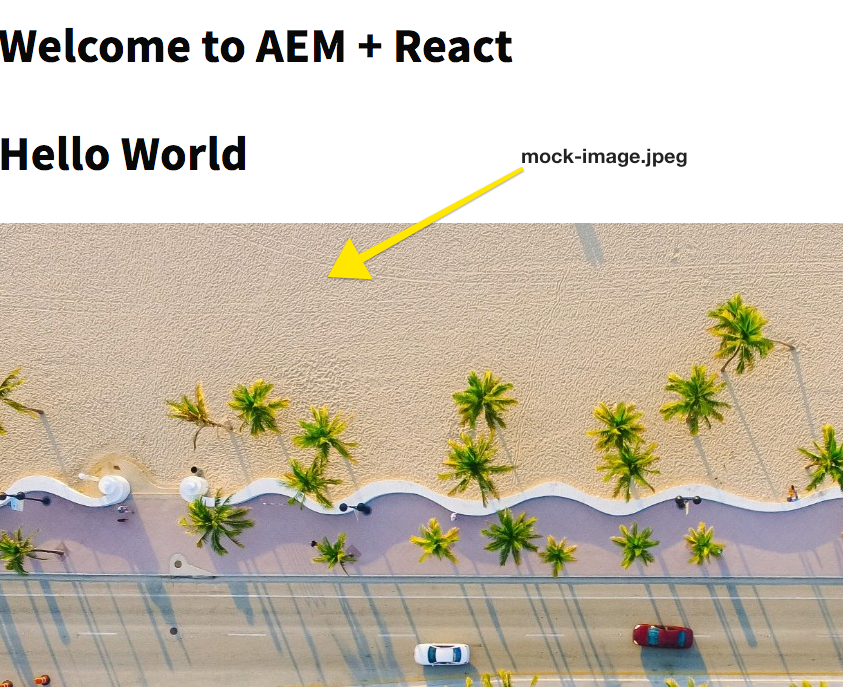

# Chapter 2 - Front End Development

This chapter focuses on Front End development outside of AEM. In the previous chapter every time a change was made to the React app we had to endure a lengthy build and deploy process to AEM. In this chapter we will look at two different ways of developing the React app against the development server that comes packaged with the React app. Developers will be able to modify JS and CSS files and see the changes immediately reflected in the browser without having to do a full project build, resulting in rapid development. We will also install several popular front end tools to accelerate the development process.

## Install Sass Support

A React best practice is to keep each component modular and self contained. A general recomendation is to avoid re-using the same CSS class name across components, which make the use of preprocessors not as powerful. This project will use [Sass](https://sass-lang.com/) for a few useful features like variables and mixins. This project will also loosely follow [SUIT CSS naming conventions](https://github.com/suitcss/suit/blob/master/doc/components.md). SUIT is a variation of BEM notation, Block Element Modifier, used to create consistent CSS rules.

Open a new terminal window.

1. Navigate to the `react-app` directory

  ```bash
  $ cd <src>/aem-guides-wknd-events/react-app
  ```

2. Install **[node-sass](https://github.com/sass/node-sass)**

  ```sh
  $ npm install node-sass --save
  ```
3. We can now use `.scss` files and the power of Sass in the project. More information can be found here for [adding a Sass stylesheet with a React project](https://github.com/facebook/create-react-app/blob/master/packages/react-scripts/template/README.md#adding-a-sass-stylesheet).

4. Open up the `react-app` in the editor of your choice. 

  Add a folder beneath `react-app/src` named `styles`. 
  Add two files beneath `styles` named `_shared.scss` and `_variables.scss`

  ```diff
    /aem-guides-wknd-events
      /react-app
        /src
          /components
  +       /styles
  +          _shared.scss
  +          _variables.scss
  ```
  These files will include some global variables and mixins we want to re-use across the project.

5. Populate `_variables.scss` with the following:

  ```css
  //variables for WKND Events

  //Typography
  $em-base:             20px;
  $base-font-size:      1rem;
  $small-font-size:     1.4rem;
  $lead-font-size:      2rem;
  $title-font-size:     5.2rem;
  $h1-font-size:        3rem;
  $h2-font-size:        2.5rem;
  $h3-font-size:        2rem;
  $h4-font-size:        1.5rem;
  $h5-font-size:        1.3rem;
  $h6-font-size:        1rem;
  $base-line-height:    1.5;
  $heading-line-height: 1.3;
  $lead-line-height:    1.7;

  $font-serif:         'Asar', serif;
  $font-sans:          'Source Sans Pro', sans-serif;

  $font-weight-light:      300;
  $font-weight-normal:     400;
  $font-weight-semi-bold:  600;
  $font-weight-bold:       700;

  //Colors
  $color-white:            #ffffff;
  $color-black:            #080808;

  $color-yellow:           #FFEA08;
  $color-gray:             #808080;
  $color-dark-gray:        #707070;

  //Functional Colors

  $color-primary:          $color-yellow;
  $color-secondary:        $color-gray;
  $color-text:             $color-gray;
              

  //Layout
  $max-width: 1200px;
  $header-height: 80px;
  $header-height-big: 100px;

  // Spacing
  $gutter-padding: 12px;

  // Mobile Breakpoints
  $mobile-screen: 160px;
  $small-screen:  767px;
  $medium-screen: 992px;
  
  ```
6. Populate the `_shared.scss` with the following Sass mixins:

  ```css
  @import './variables';

  //Mixins
  @mixin media($types...) {
      @each $type in $types {

        @if $type == tablet {
          @media only screen and (min-width: $small-screen + 1) and (max-width: $medium-screen) {
            @content;
          }
        }
    
        @if $type == desktop {
          @media only screen and (min-width: $medium-screen + 1) {
            @content;
          }
        }

        @if $type == mobile {
          @media only screen and (min-width: $mobile-screen + 1) and (max-width: $small-screen) {
            @content;
          }
        }
      }
    }
    
    @mixin content-area () {
      max-width: $max-width;
      margin: 0 auto;
      padding: $gutter-padding;
    }

    @mixin component-padding() {
        padding: 0 $gutter-padding !important;
    }

    @mixin drop-shadow () {
      box-shadow: 0 4px 8px 0 rgba(0, 0, 0, 0.2), 0 6px 20px 0 rgba(0, 0, 0, 0.19);
    }
  ```

  In the next sections we will start to use the above Sass variables and mixins in the application.


## Proxy JSON and other content from AEM

The first approach to rapid development will be to configure a proxy between the development server that is bundled with the React project and a local AEM instance. With this approach, requests to AEM content like the JSON Model and images will be made available and served as if the request(s) had originated on the static development server. 

See here for more information on [Proxying API Requests in Development](https://github.com/facebook/create-react-app/blob/master/packages/react-scripts/template/README.md#proxying-api-requests-in-development).

It is assumed that an AEM instance is running locally at http://localhost:4502.

In the editor of your choice open `/aem-guides-wknd-events/react-app`.

1. Update `react-app/package.json` to configure the proxy endpoint:

  ```diff
  "scripts": {
      "start": "react-scripts start",
      "build": "react-scripts build && clientlib --verbose",
      "test": "react-scripts test",
      "eject": "react-scripts eject",
      "styleguide": "styleguidist server",
      "styleguide:build": "styleguidist build"
    },
  +  "proxy": "http://localhost:4502",
   "eslintConfig": {
    "extends": "react-app"
  }
  ```

2. Create a file beneath `/aem-guides-wknd-events/react-app` named `.env.development`. Populate it with the following:

  ```
  # Configure Proxy end point
  REACT_APP_PAGE_MODEL_PATH=/content/wknd-events/react.model.json
  ```
  `.env.development` is an example of an environment variables file when running the application in *development* mode. More information around setting up [environment variables can be found here](https://github.com/facebook/create-react-app/blob/master/packages/react-scripts/template/README.md#adding-custom-environment-variables). 
  
  In `src/index.js` there is already a line to initialize JSON Model using the environment variable `REACT_APP_PAGE_MODEL_PATH`:
  
  ```js
  // src/index.js
 
  ModelManager.initialize({ path: process.env.REACT_APP_PAGE_MODEL_PATH }).then(render);
  ```

  The request to `/content/wknd-events/react.model.json` won't exist on the static server, so it will be proxied in from AEM when running the app in development mode.

3. Open a terminal window and start the React app in development mode:

  ```bash
  $ cd <src>/aem-guides-wknd-events/react-app
  $ npm start

    Starting the development server...
    Compiled Successfully!

    You can now view react-app in the browser.
    Local:            http://localhost:3000/
  ```

4. Navigate to http://localhost:3000/content/wknd-events/react/home.html

  You should now see the React app on the development server running with the same content as on the AEM instance:

  

  > Important! Since AEM author instance has an authentication requirement it will be necessary to open a new tab in the browser and log in to the local AEM instance. If you see a blank screen this is most likely the case. 
  
  The way the proxy feature is set up in the [Create React App](https://github.com/facebook/create-react-app/blob/master/packages/react-scripts/template/README.md) (and at the time this tutorial was written) should negate any [CORS issues](http://stackoverflow.com/questions/21854516/understanding-ajax-cors-and-security-considerations) If you see any errors like below during development look at updating the [AEM CORS configuration](https://helpx.adobe.com/experience-manager/kt/platform-repository/using/cors-security-article-understand.html).

  ```
  Fetch API cannot load http://localhost:4502/content.... No 'Access-Control-Allow-Origin' header is present on the requested resource. Origin 'http://localhost:3000' is therefore not allowed access. If an opaque response serves your needs, set the request's mode to 'no-cors' to fetch the resource with CORS disabled.
  ```

5. Re-name `/src/index.css` -> `index.scss`. Update `index.scss` with the following:

```css
/* src/index.scss */

@import './styles/shared';

/* Google Font import */
@import url('https://fonts.googleapis.com/css?family=Asar|Source+Sans+Pro:400,600,700');

body {
    //font-weight: $normal;
    background-color: $color-white;
    font-family: $font-sans;
    margin: 0;
    padding: 0;

    font-weight: $font-weight-light;
    font-size: $em-base;
    text-align: left;
    color: $color-black;
    line-height: 1.5;
    line-height: 1.6;
    letter-spacing: 0.3px;
}

h1, h2, h3, h4 {
    font-family: $font-sans;
}

h1 {
  font-size:  $h1-font-size;
}

h2 {
  font-size: $h2-font-size;
}

h3 {
  font-size: $h3-font-size;
}

h4 {
  font-size: $h4-font-size;
}

h5 {
  font-size: $h5-font-size;
}

h6 {
  font-size: $h6-font-size;
}

p {
  color: $color-text;
  font-family: $font-serif;
}

ul {
    list-style-position: inside;
}

// abstracts/overrides

ol, ul {
    padding-left: 0;
    margin-bottom: 0;
}

hr {
    height: 2px;
    //background-color: fade($dusty-gray, (.3*100));
    border: 0 none;
    margin: 0 auto;
    max-width: $max-width;
}

*:focus {
    outline: none;
}

textarea:focus, input:focus{
        outline: none;
}

body {
    overflow-x: hidden;
}

img {
    vertical-align: middle;
    border-style: none;
    width: 100%;
}
```

6. Update `src/index.js` to include `index.scss` instead of `index.css`:

```diff
/* src/index.js */
import React from 'react';
import ReactDOM from 'react-dom';
import { ModelManager, Constants } from '@adobe/cq-spa-page-model-manager';
- import './index.scss';
+ import './index.scss';
import App from './App';
```

7. Return to the browser and navigate to http://localhost:3000/content/wknd-events/react/home.html.

  You should see that the fonts have changed. Make some test changes to `index.scss` and verify that the changes are automatically compiled and displayed on the static server.

  

## Mock JSON

Another approach to rapid development is to use a static or mock JSON file to develop against. This removes the dependency on a local AEM instance. It also allows the Front End developer to update the JSON in order to test functionality and mock new JSON responses without the dependency on a Back End developer.

The initial set up of the mock JSON will require a local AEM instance.

1. In the browser navigate to http://localhost:4502/content/wknd-events/react.model.json

  This is the JSON exported by AEM that is driving the application. Copy the JSON output.

2. Open the React app in the editor of your choice: `<src>/aem-guides-wknd-events/react-app`.
3. Underneath `react-app` there should be a folder named `public`. Add a new file named `mock.model.json`:

```diff
/aem-guides-wknd-events
  /react-app
    /public
      favicon.ico
      index.html
      manifest.json
+     mock.model.json
    /src
```

4. Paste the copied JSON from the previous step into `mock.model.json`

  ```json
  {
    ":items": {},
    ":itemsOrder": [],
    ":type": "wknd-events/components/structure/app",
    ":hierarchyType": "page",
    ":path": "/content/wknd-events/react",
    ":children": {
        "/content/wknd-events/react/home": {
            ":items": {
                "root": {
                    "gridClassNames": "aem-Grid aem-Grid--12 aem-Grid--default--12",
                    "columnCount": 12,
                    "columnClassNames": {
                        "responsivegrid": "aem-GridColumn aem-GridColumn--default--12"
                    },
                    ":items": {
                        "responsivegrid": {
                            "gridClassNames": "aem-Grid aem-Grid--12 aem-Grid--default--12",
                            "columnCount": 12,
                            "columnClassNames": {
                                "image": "aem-GridColumn aem-GridColumn--default--9 aem-GridColumn--offset--default--0 aem-GridColumn--default--none",
                                "text": "aem-GridColumn aem-GridColumn--default--12"
                            },
                            ":items": {
                                "text": {
                                    "text": "<h1>Hello World</h1>\r\n",
                                    "richText": true,
                                    ":type": "wknd-events/components/content/text"
                                },
                                "image": {
                                    "alt": "Alternative Text here",
                                    "title": "This is a caption",
                                    "src": "/content/wknd-events/react/home/_jcr_content/root/responsivegrid/image.coreimg.jpeg/1539196394835.jpeg",
                                    "srcUriTemplate": "/content/wknd-events/react/home/_jcr_content/root/responsivegrid/image.coreimg{.width}.jpeg/1539196394835.jpeg",
                                    "lazyEnabled": false,
                                    "widths": [],
                                    ":type": "wknd-events/components/content/image"
                                }
                            },
                            ":itemsOrder": [
                                "text",
                                "image"
                            ],
                            ":type": "wcm/foundation/components/responsivegrid"
                        }
                    },
                    ":itemsOrder": [
                        "responsivegrid"
                    ],
                    ":type": "wcm/foundation/components/responsivegrid"
                }
            },
            ":itemsOrder": [
                "root"
            ],
            ":type": "wknd-events/components/structure/page",
            ":hierarchyType": "page",
            ":path": "/content/wknd-events/react/home",
            "title": "Home"
        }
    },
    "title": "React App"
}
```

5. Add a new folder beneath the `public` folder named `images`. Select an image from your desktop and add it to the `images` folder:

```diff
/aem-guides-wknd-events
  /react-app
    /public
      favicon.ico
      index.html
      manifest.json
      mock.model.json
+     /images
+        mock-image.jpeg 
    /src
```

6. Update the `mock.model.json` to point to the local image source versus the one from AEM Assets. In `mock.model.json` search for `wknd-events/components/content/image`. Update the `src` value

```diff

  "image": {
          "alt": "Alternative Text here",
          "title": "This is a caption",
-         "src": "/content/wknd-events/react/home/_jcr_content/root/responsivegrid/image.coreimg.jpeg/1539196394835.jpeg",
+         "src": "/images/mock-image.jpeg",
          "srcUriTemplate": "/content/wknd-events/react/home/_jcr_content/root/responsivegrid/image.coreimg{.width}.jpeg/1539196394835.jpeg",
          "lazyEnabled": false,
          "widths": [],
          ":type": "wknd-events/components/content/image"
      }
```

7. Update `react-app/.env.development` file to point to the `mock.model.json`. Comment out the proxy `REACT_APP_PAGE_MODEL_PATH` for now.

```diff
  #Request the JSON from AEM
  #REACT_APP_PAGE_MODEL_PATH=/content/wknd-events/react.model.json

  # Request the JSON from Mock JSON
+ REACT_APP_PAGE_MODEL_PATH=mock.model.json
```

8. If it is still running, restart the React development server. Environment variables are only embedded at build time, hence the need to restart if any change is made.

9. Navigate to to http://localhost:3000/content/wknd-events/react/home.html. The mock image should now be shown.

  

10. Make some other content changes to `mock.model.json` and see the changes automatically reflected in the browser. 

  

  The ability to modify the JSON model outside of AEM is quite powerful for Front End developers to be able to work in parallel with Back End developers.
  
  For the rest of the chapter feel free to develop locally against either the mock JSON or the proxied JSON.

## Header Component

Next a dedicated React component will be created for the header of the application.

1. Beneath `/react-app/src/components` add a folder named `header`. Beneath `/header` add two files named `Header.js` and `Header.scss`:

```diff
/react-app
  /src
    /components
+      /header
+        Header.js
+        Header.scss
      /image
      /page
```

2. Populate `Header.js` with the following to create a React component for the Header:

```javascript
// src/components/header/Header.js

import React, {Component} from 'react';
import './Header.scss';

export default class Header extends Component {

  render() {
      return (
      <header className="Header">
          <div className="Header-wrapper">
              <h1 className="Header-title">WKND<span className="Header-title--inverse">_</span></h1>
          </div>
        </header>
      );
  }
}
```

3. Populate `Header.scss` with the following to add some styles to the component:

```css
@import '../../styles/shared';

.Header {
    background-color: $color-primary;
    height: $header-height;
    width: 100%;
    position: fixed;
    top: 0;
    z-index: 99;

    @include media(tablet,desktop) {
      height: $header-height-big;
    }

    &-wrapper {
        @include content-area();
        display: flex;
        justify-content: space-between;
    }

    &-title {
        font-family: 'Helvetica';
        font-size: 20px; 
        float: left;
        padding-left: $gutter-padding;
    
        @include media(tablet,desktop) {
          font-size: 24px;
        }
    }

    &-title--inverse {
        color: $color-white;
    }
  }

```

4. Update `App.js` at `react-app/src/App.js` to include the Header component:

```diff
import React from 'react';
import { Page, withModel, EditorContext, Utils } from '@adobe/cq-react-editable-components';
+ import Header from './components/header/Header';

// This component is the application entry point
class App extends Page {

    render() {
        return (
            <div className="App">
+                <Header />
                <EditorContext.Provider value={ Utils.isInEditor() }>
```

5. Update **body** rule in the file `index.scss` at `react-app/src/index.scss` to account for the header height:

```diff
/* index.scss */
body {
    //font-weight: $normal;
    background-color: $color-white;
    font-family: $font-sans;
    margin: 0;
    padding: 0;
    font-weight: $font-weight-light;
    font-size: $em-base;
    text-align: left;
    color: $color-black;
    line-height: 1.5;
    line-height: 1.6;
    letter-spacing: 0.3px;

+    padding-top: $header-height-big;
+    @include media(mobile, tablet) {
+        padding-top: $header-height;
+    }
}
```

6. On the static development server you should now see the changes to the header:

  

## Update Image Component

Next we will add the option to display a caption below the Image component if `props.title` is populated:

1. Update `react-app/src/components/image/Image.js` with the following:

```diff
import React, {Component} from 'react';
import {MapTo} from '@adobe/cq-react-editable-components';
+ require('./Image.scss');

...

class Image extends Component {

+    get caption() {
+        if(this.props.title && this.props.title.length > 0) {
+            return <span className="Image-caption">{this.props.title}</span>;
+        }
+        return null;
+    }

    get content() {
        return 
    }

    render() {
        return (<div className="Image">
                {this.content}
+               {this.caption}
            </div>);
    }
}
```

2. Beneath `react-app/src/components/image/` add a new file named `Image.scss`. Populate it with the following:

```css
@import '../../styles/shared';

.Image {
  @include component-padding();

  &-image {
    margin: 2rem 0;
    width: 100%;
    border: 0;
    font: inherit;
    padding: 0;
    vertical-align: baseline; 
  }

  &-caption {
    color: $color-white;
    background-color: $color-black;
    height: 3em;
    position: relative;
    padding: 20px 10px;
    top: -10px;
    @include drop-shadow();

    @include media(tablet) {
        padding: 25px 15px;
        top: -14px;
    }

    @include media(desktop) {
        padding: 30px 20px;
        top: -16px;
    }
  }
}
```

3. On the static development server you should now see the changes to the Image component:

  

## Update Text Component

Next we will make some small modifications to the Text component to promote consistency across all of the mapped components.

1. Update the `render()` function in `react-app/src/components/text/Text.js` with the following to add a wrapper div. Also add an import of a `Text.scss` file.

```diff
  import React, {Component} from 'react';
  import {MapTo} from '@adobe/cq-react-editable-components';
+ require('./Text.scss');

...

class Text extends Component {

...

    render() {
+        let innercontent = this.props.richText ? this.richTextContent : this.textContent;
+        return (<div className="Text">
+                {innercontent}
+            </div>);
    }
}
...
```

2. Beneath `react-app/src/components/text/` add a new file named `Text.scss`. Populate it with the following:

```
@import '../../styles/shared';

.Text {
  @include component-padding();
}
```


## Style Guidist

https://github.com/facebook/create-react-app/blob/master/packages/react-scripts/template/README.md#getting-started-with-styleguidist


## Update to use SASS (move to part 2?)

1. Install SASS

```
$ npm install node-sass --save
```

2. 


## Header Component

## Global Styles (SASS, Header)

## Responsive Grid

1. Create responsive grid Client library
2. update `clientlib.config.js` to include responsive grid
3. update `public/index.html` for dev purposes

## Install Storybook (optional)

## Update Image Component 

1. In AEM add a title to Image -> view nothing happens
2. View json output to see that title property is available
3. Return to the react-app -> update Image.js to include caption
4. Update SCSS
5. Test outside of AEM


Notes:

```
* Primary goal of this chapter is to create the Article Template
* Introduction of Layout Container and iterative concepts
* Integration of Responsive grid styles
* FED mock JSON → how to? how responsive styles are part of JSON
* Basic article page

1. Introduction of Layout Container / Responsive grid
2. Add Root + responsivegrid at Template
3. Update App.js to extend Container
4. Include page.js ?
5. Include SASS preprocessor to Webpack project
6. include WKND base variables/styles
7. Implement Title Component
8. Implement Image Component

```


