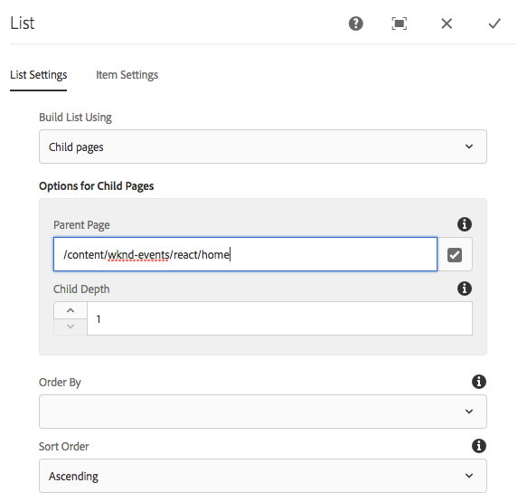

# Chapter 3 - Navigation and Routing

# Install React Router

1. 

```
npm install --save react-router
```

2. 

```
npm install --save react-router-dom
```

3. Add Utils for RouteHelper new folder `utils`.

```
import React, {Component} from 'react';
import {Route} from 'react-router-dom';
import { withRouter } from 'react-router';

/**
 * Helper that facilitate the use of the {@link Route} component
 */

/**
 * Returns a composite component where a {@link Route} component wraps the provided component
 *
 * @param {React.Component} WrappedComponent    - React component to be wrapped
 * @param {string} [extension=html]             - extension used to identify a route amongst the tree of resource URLs
 * @returns {CompositeRoute}
 */
export const withRoute = (WrappedComponent, extension) => {
    return class CompositeRoute extends Component {
        render() {
            let routePath = this.props.cqPath;
            if (!routePath) {
                return <WrappedComponent {...this.props}/>;
            }

            extension = extension || 'html';

            // Context path + route path + extension
            return <Route key={ routePath } path={ '(.*)' + routePath + '.' + extension } render={ (routeProps) => {
                return <WrappedComponent {...this.props} {...routeProps}/>;
            } } />
        }
    }
};

/**
 * ScrollToTop component will scroll the window on every navigation.
 * wrapped in in `withRouter` to have access to router's props.
 */
class ScrollToTop extends Component {
    componentDidUpdate(prevProps) {
      if (this.props.location !== prevProps.location) {
        window.scrollTo(0, 0)
      }
    }
    render() {
      return this.props.children
    }
  }
  export default withRouter(ScrollToTop);
```

4. Update index.js

```diff
  import './index.scss';
  import App from './App';
  import "./components/MappedComponents";
+ import {BrowserRouter} from 'react-router-dom';
+ import ScrollToTop from './utils/RouteHelper';
 
  function render(model) {
     ReactDOM.render((
+        <BrowserRouter>
+            <ScrollToTop>
            <App cqChildren={ model[Constants.CHILDREN_PROP] } cqItems={ model[Constants.ITEMS_PROP] } cqItemsOrder={ model[Constants.ITEMS_ORDER_PROP] }
                cqPath={ ModelManager.rootPath } locationPathname={ window.location.pathname }/>
+             </ScrollToTop>
+        </BrowserRouter>), 
        document.getElementById('root'));
  }
 
 ModelManager.initialize({ path: process.env.REACT_APP_PAGE_MODEL_PATH }).then(render);
```

5. Update Page.js

```diff
    import {Page, MapTo, withComponentMappingContext } from "@adobe/cq-react-editable-components";
+   import {withRoute} from '../../utils/RouteHelper';
    require('./Page.scss');

    // This component is a variant of a React Page component mapped to the "structure/page" resource type
    // For now, the rendering is the same as the RootPage; this is more for illustration purposes
    class WkndPage extends Page {
    
        get containerProps() {
            let attrs = super.containerProps;
            attrs.className = (attrs.className || '') + ' WkndPage ' + (this.props.cssClassNames || '');
            return attrs
        }
    }
-   MapTo('wknd-events/components/structure/page')(withComponentMappingContext(WkndPage));    
+   MapTo('wknd-events/components/structure/page')(withComponentMappingContext(withRoute(WkndPage)));
```

6. Update App.js (possibly move this below)

```
import React from 'react';
import { Page, withModel, EditorContext, Utils } from '@adobe/cq-react-editable-components';
import { Redirect } from 'react-router';
import Header from './components/header/Header';
import './App.scss';

 /**
  * Returns a model path from the given URL


import { ModelManager, Constants } from "@adobe/cq-spa-page-model-manager";

/**
 * Returns a model path from the given URL
 * @param {string} url     - Path from which to extract a model path
 * @return {string|undefined}
 */
function getModelPath(url) {
    if (!url) {
        return;
    }

    let dotIndex = url.indexOf(".");
    return url.substr(0, dotIndex > -1 ? dotIndex : url.length);
}

/**
 * Should the App redirect to the home page
 *
 * @param {string} modelUrl     - Path of the current model
 * @return {boolean}
 */
function canRedirectHome(modelUrl, pathname) {
    if (!pathname) {
        return false;
    }
    const currentUrl = getModelPath(pathname);
    // 1. if a model url has been provided
    // 2. if the current URL is located under the content
    // 3. if app root model path equals the current URL
    return modelUrl && modelUrl.indexOf('/content/') > -1 && (modelUrl === currentUrl || modelUrl.endsWith(currentUrl));
}

// This component is the application entry point
class App extends Page {

    get redirect() {
        const modelRootPath = this.props.cqPath;
        const locationPathname = this.props.locationPathname;

        if (canRedirectHome(modelRootPath, locationPathname)) {
            // Redirect to the home url
            return <Redirect to={ modelRootPath + '/home.html' }/>;
        }
    }

    render() {
        return (
            <div className="App">
                <Header />
                <EditorContext.Provider value={ Utils.isInEditor() }>
                    { this.redirect }
                    { this.childComponents }
                    { this.childPages }
                </EditorContext.Provider>
            </div>
          );
    }
}

export default withModel(App);
```

# List Component

1. List.js

```js
import React, {Component} from 'react';
import {MapTo} from '@adobe/cq-react-editable-components';
import {Link} from "react-router-dom";
require('./List.scss');


const ListEditConfig = {

    emptyLabel: 'List',

    isEmpty: function(props) {
        return !props || !props.items || props.items.length < 1;
    }
};

/**
 * ListItem renders the individual items in the list
 */
class ListItem extends Component {

    get date() {
       if(!this.props.date) {
           return null;
       }
        let date = new Date(this.props.date);
        return date.toLocaleDateString('en-US');
    }

    render() {
        if(!this.props.path || !this.props.title || !this.props.url) {
            return null;
        }
        return (
            <li className="ListItem" key={this.props.path}>
                <Link className="ListItem-link" to={this.props.url}>{this.props.title}
                    <span className="ListItem-date">{this.date}</span>
                </Link>
            </li>
        );
    }
}

/**
 * List renders the list contents and maps wknd-events/components/content/list
 */
export default class List extends Component {
    render() {
        return (
                <div className="List">
                    <ul className="List-wrapper">
                        { this.props.items && this.props.items.map((listItem, index) => {
                            return <ListItem path={listItem.path} url={listItem.url} 
                                             title={listItem.title} date={listItem.lastModified} />
                            })
                       }
                    </ul>
                </div>
        );
    }
}

MapTo("wknd-events/components/content/list")(List, ListEditConfig);
```

2. List.scss

```css
@import '../../styles/shared';

.List {
    @include component-padding();
}

.ListItem {
    list-style: none;
    float: left;
    width: 100%;
    margin-bottom: 1em;
    font-size: $lead-font-size;
    padding: 4px;
    color: #0045ff;

    &:hover {
        background-color: #ededed;
    }

    &-link {
        text-decoration: none;
    }

    &-date {
        width: 100%;
        float:left;
        color: $color-secondary;
        font-size: $base-font-size;
    }
}
```

3. MappedComponents.js

```diff
  require('./page/Page');
  require('./text/Text');
  require('./image/Image');
+ require('./list/List');
```

4. Deploy to AEM

5. Create a new Page structure

```
/content
    /wknd-events
        /react
            /home
                /first-article
                /second-article
```

6. Create a new List component




## Add navigation to Header component

1. Header.js

```diff
 import React, {Component} from 'react';
+import {Link} from "react-router-dom";
+import { withRouter } from 'react-router';
+import { FontAwesomeIcon } from '@fortawesome/react-fontawesome';
 import './Header.scss';
 
-export default class Header extends Component {
+class Header extends Component {
+
+    get homeLink() {
+        let currLocation;
+        currLocation = this.props.location.pathname;
+        currLocation = currLocation.substr(0, currLocation.length - 5);
+
+        if(this.props.navigationRoot && currLocation !== this.props.navigationRoot) {
+            return (<Link className="Header-action" to={ this.props.navigationRoot + ".html" }>
+                      Home
+                    </Link>);
+        }
+    }
 
     render() {
         return (
         <header className="Header">
             <div className="Header-wrapper">
                 <h1 className="Header-title">WKND<span className="Header-title--inverse">_</span></h1>
+                <div className="Header-tools">
+                    { this.homeLink }
+                </div>
             </div>
           </header>
         );
 
     }
 
-} 
+}
+
+export default withRouter(Header); 

```

2. Update App.js

```diff
 import React from 'react';
 import { Page, withModel, EditorContext, Utils } from '@adobe/cq-react-editable-components';
+import { Redirect } from 'react-router';
```

3. Add functions outside of the App class to redirect if not the Home page

```js
    import Header from './components/header/Header';

    /**
     * Returns a model path from the given URL
     * @param {string} url     - Path from which to extract a model path
     * @return {string|undefined}
     */
    function getModelPath(url) {
        if (!url) {
            return;
        }

        let dotIndex = url.indexOf(".");
        return url.substr(0, dotIndex > -1 ? dotIndex : url.length);
    }

    /**
     * Should the App redirect to the home page
     *
     * @param {string} modelUrl     - Path of the current model
     * @return {boolean}
     */
    function canRedirectHome(modelUrl, pathname) {
        if (!pathname) {
            return false;
        }
        const currentUrl = getModelPath(pathname);
        // 1. if a model url has been provided
        // 2. if the current URL is located under the content
        // 3. if app root model path equals the current URL
        return modelUrl && modelUrl.indexOf('/content/') > -1 && (modelUrl === currentUrl || modelUrl.endsWith(currentUrl));
    }

    // This component is the application entry point
    class App extends Page {
        ...
```

4. Update App component to implement a redirect method:

```diff

class App extends Page {
 
+    get redirect() {
+        const modelRootPath = this.props.cqPath;
+        const locationPathname = this.props.locationPathname;
+
+        if (canRedirectHome(modelRootPath, locationPathname)) {
+            // Redirect to the home url
+            return <Redirect to={ modelRootPath + '/home.html' }/>;
+        }
+    }
+
     render() {
         return (
             <div className="App">
-                <Header />
+                <Header navigationRoot="/content/wknd-events/react/home" />
                 <EditorContext.Provider value={ Utils.isInEditor() }>
+                    { this.redirect }
                     { this.childComponents }
                     { this.childPages }
                 </EditorContext.Provider>
```

## Add Font Awesome Icons

* instructions: https://fontawesome.com/how-to-use/on-the-web/using-with/react

1. 

```
$ npm i --save @fortawesome/fontawesome-svg-core \
  npm i --save @fortawesome/free-solid-svg-icons \
  npm i --save @fortawesome/react-fontawesome

```

2. Create a file named `react-app/src/utils/Icon.js`

```js
import { library } from '@fortawesome/fontawesome-svg-core';
import { faCheckSquare, faChevronLeft, faSearch, faHeadphonesAlt, faMusic, faCamera, faFutbol, faPaintBrush, faTheaterMasks} from '@fortawesome/free-solid-svg-icons';

library.add(faCheckSquare, faChevronLeft, faSearch, faHeadphonesAlt, faMusic, faCamera, faFutbol, faPaintBrush, faTheaterMasks);

```

3. Update Header.scss

```diff
@import '../../styles/shared';
 
+$icon-size-lg: 46px;
+$icon-size-md: 40px;
+$icon-size-sm: 32px;

 .Header {
     background-color: $color-primary;
     height: $header-height;

    ...

     &-title--inverse {
         color: $color-white;
     }

+    &-tools {
+        padding-top: 8px;
+        padding-right: $gutter-padding;
+    }
+
+    &-action {
+        background: $color-white;
+        border-radius: 100%;
+        width:  $icon-size-sm;
+        height:   $icon-size-sm;
+        font-size:   18px;
+        color: $color-black;
+        text-align: center;
+        align-content: center;
+        float: left;
+        margin-right: 1.5rem;
+        
+        &:last-child {
+          margin-right: 0;
+        }
+    
+        .svg-inline--fa {
+          position:relative;
+          top: 2.5px;
+          right: 1px;
+        }
+    
+        @include media(desktop) {
+          width:  $icon-size-lg;
+          height:   $icon-size-lg;
+          font-size:   26px;
+        }
+    
+        @include media(tablet) {
+          width:  $icon-size-md;
+          height:   $icon-size-md;
+          font-size:   22px;
+        }
+      }
+
   } 
```

4. Update Header.js

```diff

    if (this.props.navigationRoot && currLocation !== this.props.navigationRoot) {
            return (<Link className="Header-action" to={this.props.navigationRoot + ".html"}>
-                Back            
+                <FontAwesomeIcon icon="chevron-left" />
            </Link>);
        }

```

5. Run the Development Server

```
$ cd <src>/aem-guides-wknd-events/react-app
$ npm start
```

Navigate to: http://localhost:3000/content/wknd-events/react.hml

6. Deploy to AEM


